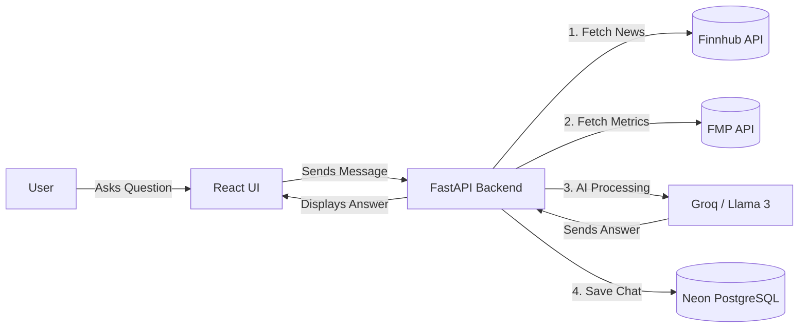

# StockGPT: Comprehensive Architecture & Design Guide

This document breaks down **StockGPT** from top to bottom. It is designed to be beginner-friendly so you can fully understand the magic behind your AI financial assistant.

---

## 1. High-Level Design (The Big Picture)

At a high level, StockGPT acts as a bridge between a human user and complex financial data. When you ask a question like *"Is Tesla a good buy right now?"*, the system doesn't just guess; it goes out to the real world, grabs live financial data, reads it instantly, and summarizes it for you.

The architecture is split into two main parts:
1. **The Frontend (React/Vite):** This is the beautiful, glowing interface you see in your browser. It handles user inputs, animations, and displaying charts. 
2. **The Backend (Python/FastAPI):** This is the "brain." It talks to databases, fetches live news, runs the AI models, and performs all the heavy calculations.

---

## 2. The Tech Stack (What Tools We Used)

### Frontend (User Interface)
* **React.js & Vite:** Used to build the website. Vite makes the website load and refresh extremely fast during development.
* **Vanilla CSS:** Used for custom, beautiful cyberpunk-style aesthetics (gradients, glowing borders, animations).

### Backend (The Brain)
* **Python:** The programming language used because it has the best libraries for AI.
* **FastAPI:** A lightning-fast framework that turns our Python code into a web server that the React frontend can talk to.
* **SQLAlchemy:** A tool that lets Python talk to databases easily.

### Databases
* **Neon (PostgreSQL):** A cloud-based SQL database where we store chat histories securely.
* **FAISS (Facebook AI Similarity Search):** A specialized "Vector Database" that stores text as numbers so the AI can search through it instantly.

### APIs (Data Sources)
* **Finnhub:** Provides live company news.
* **Financial Modeling Prep (FMP):** Provides company profiles and financial metrics (like PE ratios and market caps).

---

## 3. How the AI Works: NLP, Embeddings, and RAG

This is the most important part of the project. We use three distinct AI concepts to make StockGPT smart.

### Step 1: NLP (Natural Language Processing)
* **What it is:** Teaching computers to understand human text.
* **How we use it:** When a user types *"What is the PE ratio of Apple?"*, the computer doesn't know what "Apple" is. We use a small, fast AI model (`llama-3.1-8b-instant` via Groq) to extract the "Intent". It reads the sentence and extracts the ticker symbol: **AAPL**. 

### Step 2: Embeddings (Hugging Face)
* **What it is:** An AI model that converts English sentences into long lists of numbers (coordinates).
* **How we use it:** Once we fetch 10 live news articles about Apple from Finnhub, we pass them through a free, local Hugging Face model (`all-MiniLM-L6-v2`). This model converts the articles into numbers. We store these numbers in **FAISS**.

### Step 3: RAG (Retrieval-Augmented Generation)
* **What it is:** Giving an AI an "open book test" instead of relying on its memory.
* **How we use it:** 
    1. **Retrieve:** We take the user's question, convert it into numbers, and ask FAISS to find the 5 news articles mathematically closest to the question.
    2. **Augment:** We paste those 5 articles into a hidden prompt alongside the user's original question.
    3. **Generate:** We send that massive prompt to a genius AI (`llama-3.3-70b-versatile` via Groq). Because it now has the *live context*, it generates a perfectly accurate, hallucination-free answer.

---

## 4. Low-Level Workflow (Step-by-Step Execution)

Here is exactly what happens in the code (`ai_pipeline.py` and `main.py`) the millisecond you hit "Send":

1. **Request:** React sends an HTTP POST request to `http://localhost:8000/api/chat`.
2. **Intent Extraction:** The backend runs the `get_intent_and_ticker` function. Groq reads the message and figures out the stock ticker (e.g., `TSLA`).
3. **Data Fetching:** 
   * The backend calls Finnhub for `TSLA` news.
   * The backend calls FMP for `TSLA` financial metrics.
4. **Vector Database Creation:** The backend turns the news and metrics into "Documents" and pushes them into FAISS using Hugging Face embeddings.
5. **Similarity Search:** FAISS searches its memory and pulls out the most relevant sentences.
6. **LLM Generation:** The context is fed to Groq (Llama 3.3). It reads the context and writes a professional financial summary.
7. **Storage:** The question and the AI's answer are saved to Neon PostgreSQL using SQLAlchemy.
8. **Response:** The text is sent back to React, which animates it onto the screen.

> [!TIP]
> **Why this design is powerful:** Because the heavy AI generation happens on Groq's supercomputers and the data comes from live financial APIs, StockGPT can run smoothly on almost any laptop while remaining as smart as ChatGPT!
